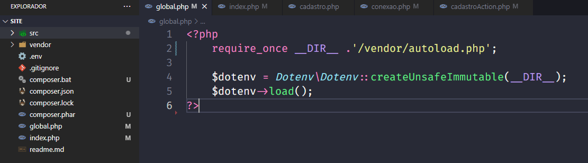
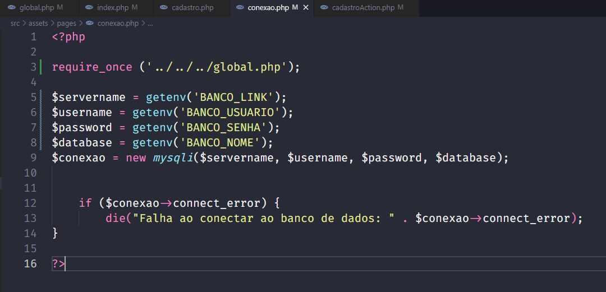
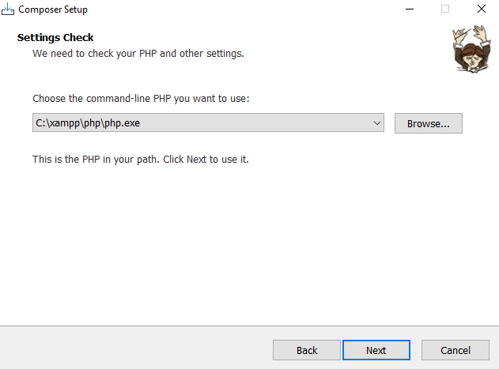

# Trabalho de Conclusão de Curso | ETEC - Projeto completo 

 

  

Além desse repositório, também foi criado um para mostrar a parte visual do site no GitHub Pages, tornando possível que o professor acompanhasse o progresso do trabalho mais facilmente, durante as entregas das documentações do TCC no penúltimo semestre do curso, enquanto era criada a parte de front-end do site.

Você pode ver a página no link abaixo: 

[⇒ Parte visual da página no GitHub Pages.](https://geovanaborba.github.io/TCC-website/)

 

  

# 📂 Documentação 

 

<h2> ✔️ Fontes e Cores </h2>

* [Poppins](https://fonts.google.com/specimen/Poppins?query=poppins)

* [Press Start 2P](https://fonts.google.com/specimen/Press+Start+2P?query=press+start)

 

    --lilas: #8888EA;
    --laranja: #FCA82F;
    --roxo: #6066D0;
    --cinza-escuro: #535050;

<h2> ✔️ Criação do Banco de Dados </h2>

 

 

Inicialmente, para a fase de testes do banco de dados, foi utilizada a ferramenta **USBWebServer** para a criação do banco de dados. 

Ela é gratuita e é possível realizar o download por meio do link: <https://usbwebserver.yura.mk.ua/>

 

Entretanto, ao decorrer do projeto, passamos a utilizar o Workbench, visto que o banco de dados foi implantado em mecanismo mySQL no [Amazon RDS](https://aws.amazon.com/pt/rds/): Um serviço da web que facilita a configuração e operação de banco de dados em nuvem AWS, tornando possível que todos do grupo do TCC utilizassem o mesmo BD.  

Dessa forma, as variáveis de conexão ficarão invisíveis por questões de segurança.

 

### Variáveis de conexão se utilizado USBWebServer

    $servername = 'localhost';
    $username = 'root';
    $password = 'usbw';
    $database = 'tcc';

 

### Criação do Database e tabela para o cadastro e login no site: 

 

    create database tcc
    CHARACTER SET utf8
    COLLATE utf8_general_ci;

    create table cadastro (
        usuario_id int (10) NOT NULL AUTO_INCREMENT,
        nome varchar (90) NOT NULL,
        username varchar (20) NOT NULL,
        email varchar (90) NOT NULL,
        senha varchar (30) NOT NULL,
        constraint pk_cadastro primary key (usuario_id),
        constraint uk_cad_name unique key (username),
        constraint uk_cad_email unique key (email)
    );

  
» As chaves únicas criadas (username e email), farão com que o usuário não consiga fazer um novo cadastro caso o username ou email já estejam no banco de dados. 

 

» Além disso, para cada usuário cadastrado é gerado um ID de usuário dentro do banco de dados, através do Auto_Increment. 

 

**Obs.:** O CHARACTER SET utf8 COLLATE utf8_general_ci irá alterar o agrupamento dos elementos. 

*"Um agrupamento MySQL é um conjunto bem definido de regras que são usadas para comparar caracteres de um determinado conjunto de caracteres usando sua codificação correspondente."* [Fonte: Acervo Lima](https://acervolima.com/o-que-e-agrupamento-e-conjunto-de-caracteres-no-mysql/#:~:text=Um%20agrupamento%20MySQL%20%C3%A9%20um,caracteres%20usando%20sua%20codifica%C3%A7%C3%A3o%20correspondente.)

 

 

 

### Banco de Dados em funcionamento 

 

 

*Img 1 e 2: O usuário preenche seus dados e é direcionado para a tela de confirmação. Ao clicar no botão, é encaminhado à tela de início do site.*

 

*Img 3: Print do banco de dados, logo após o registro do usuário teste1.*

 

 

 

## ✔️ Tabela de Pontuação e Adição de perguntas e alternativas no BD
 

 
---- Tabela para mostrar a pontuação do usuário após responder o quiz, tornando possível mostrá-la no ranking.

    create table score (
        pontuacao INT(11),
        username VARCHAR(20) NOT NULL,
        FOREIGN KEY (username) REFERENCES cadastro(username)
    );

 

 
---- Criação da Tabela Questions. Nela as questões do quiz ficarão salvas e seguras para que o usuário não as acesse antes de responder o quiz. 

    create table questions ( 
	id_question int(3) not null auto_increment, 
	question varchar(256) not null, 
	primary key (id_question) 
    );
 

 
----- Criação da tabela Alternativas. Assim como a Questions, deixará as alternativas seguras no BD para o usuário não visualizá-las.

    create table alternativas (
	id_question int(3) not null auto_increment, 
	alternativa_a varchar(256) not null, 
	alternativa_b varchar(256) not null, 
	alternativa_c varchar(256) not null, 
	alternativa_d varchar(256) not null, 
	FOREIGN KEY (id_question) REFERENCES questions (id_question) 
    );

 

<h2>✔️ Banco de Dados em nuvem - Amazon RDS </h2>

 

 

Foi criada uma conta de nível gratuito na Amazon AWS (Amazon Web Services) para utilizarmos o banco de dados através do [Amazon RDS](https://aws.amazon.com/pt/rds/) (Relational Database Service). Com ele foi possível que todos do grupo tivessem acesso ao mesmo banco de dados ao mesmo tempo, para que fizessem alterações e complementos sem necessidade de criar um local em cada máquina dos integrantes. 

O Amazon RDS é um serviço de banco de dados relacional gerenciado para MySQL, PostgreSQL, MariaDB ou SQL Server. O nível gratuito fica disponível para o usuário por 12 meses e é possível ter 750 horas de uso de instâncias executando banco de dados mySQL, Postgre, SQL Server e MariaDB por mês.  Além disso, são disponibilizados 20GB de armazenamento de banco de dados (SSD) e 20GB de armazenamento de backup. 

Conforme o próprio site diz em sua descrição sobre a plataforma, a AWS ajuda novos usuários a usar um serviço de banco de dados gerenciado na nuvem sem custos. É possível usar o nível gratuito para desenvolver aplicações, realizar testes ou simplesmente para aprender e ganhar experiência com o RDS. 

 

<h2>✔️ PHP DotEnv</h2>

 

Para a proteção de usuário e senha do banco de dados em nuvem, foi utilizado o [PHP dotenv](https://github.com/vlucas/phpdotenv). 
Com ele, os dados sensíveis são armazenados dentro de variáveis, mas não uma variável qualquer como as criadas com ‘$’(cifrão) no início delas. Com o dotenv, ela se torna uma variável de ambiente, ou seja, ela será criada no ambiente onde o PHP está.
Para isso, foi utilizado o [Composer](https://getcomposer.org/), um gerenciador de dependências. Dessa forma, criamos um arquivo global.php para chamar as dependências do Composer, dentro da pasta vendor. 
O arquivo .env não ficará visível para todos no site e dentro dele colocamos as variáveis com os dados que devem ser escondidos. 

 

 

 

 

No arquivo conexão.php, foram utilizadas as variáveis criadas dentro do arquivo .env, chamadas através da variável superglobal $_ENV[‘ ’];

 

 

Por fim, foi criado um arquivo .gitignore, para que, como o próprio nome diz, o versionamento Git ignore os arquivos que constam dentro dele e não os subam para a plataforma. 
 
  

**Instalação do Composer em sistema Linux**

Para a instalação dele em Mac ou Linux, é necessário a utilização de alguma interface de linha de comando. Também é necessário que a interface de linha de comando esteja no diretório-raiz da aplicação, antes de ser aplicado o comando: 
composer require vlucas/phpdotenv

 

**Instalação do Composer em Sistema Windows**

Para instalação em sistemas Windows, baixe o instalador clicando aqui. Depois execute a aplicação e siga os passos necessários. O instalador vai colocar o Composer no PATH do Windows, assim será possível executar o comando de qualquer diretório. 
 
 

 
Obs.: O projeto estava sendo realizado através do USBWServer. Devido essa aplicação não manter o PHP localmente, foi utilizada a ferramenta Xampp para que a instalação do Composer pudesse ser finalizada.

 

 

<h2>✔️ Verificação de Acesso </h2>

 

 

Em todas as páginas dentro do site após o login, há um require_once para verificar Acesso do usuário. 

 

 

Caso o usuário tente acessar o site sem efetuar login, ele é redirecionado para a tela de 'Acesso Negado', solicitando o login e/ou cadastro do mesmo.

Ao clicar no alerta, retorna-se à tela inicial do site. 

 

 

<h2> ✔️ Acesso Administrativo </h2>

  

 

<h2> ✔️  </h2>

  

 

